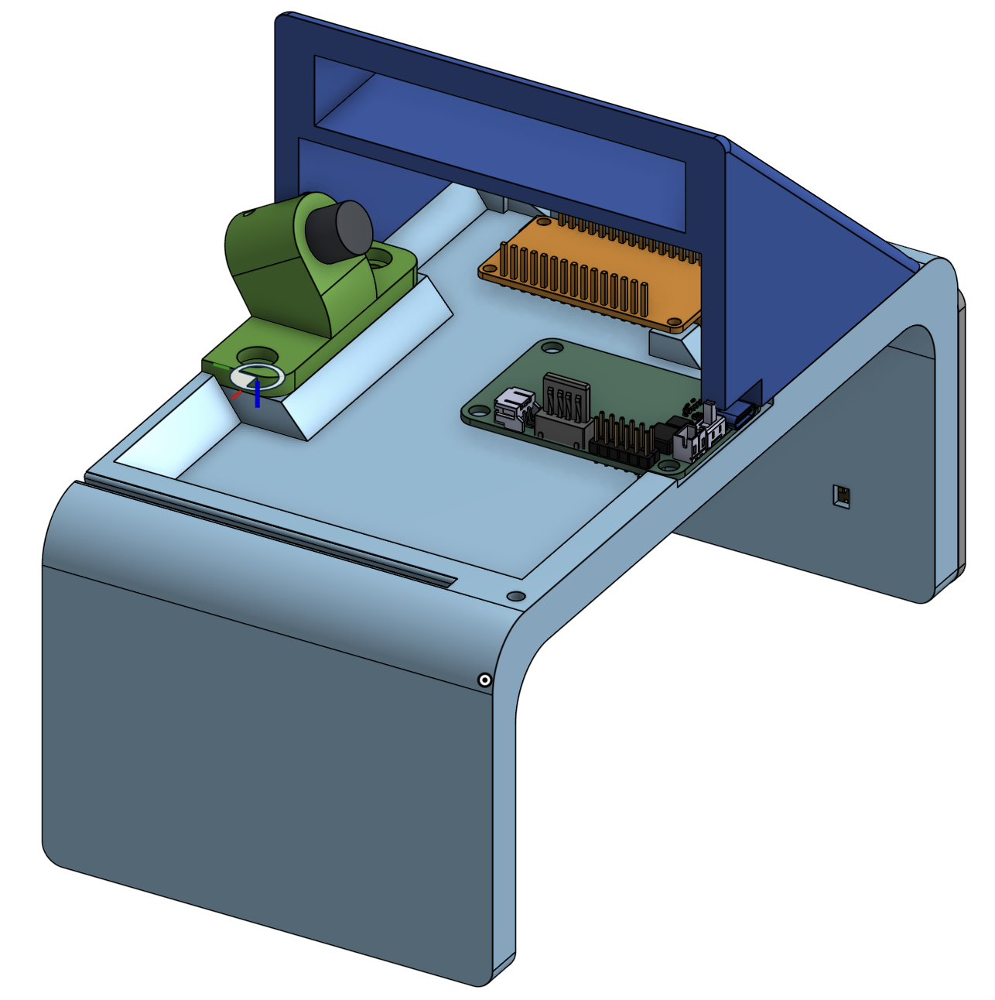
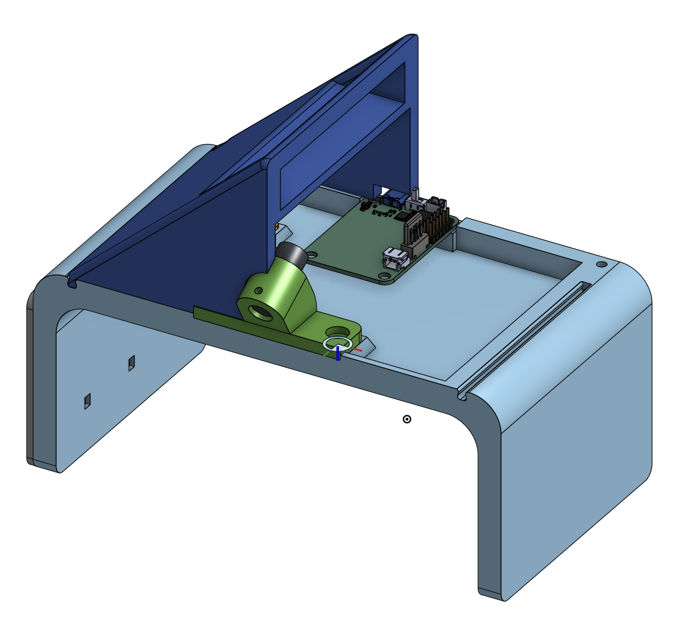
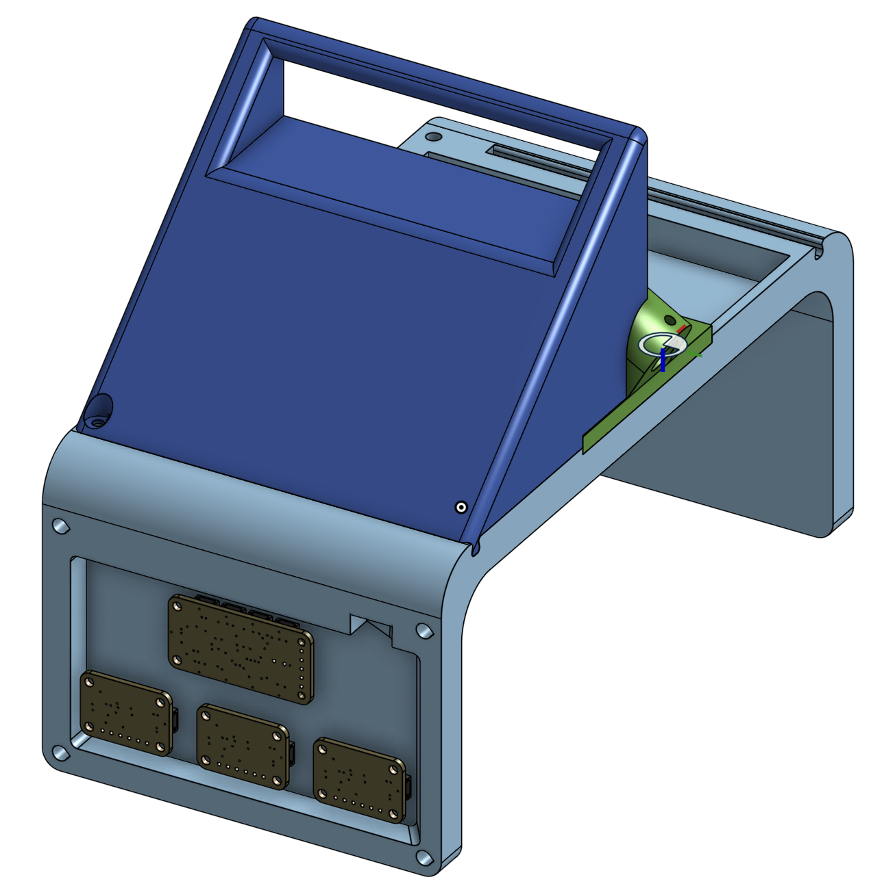

# CAD

**DISCLAIMER**: These files are a work in progress and may change at any time.

CAD for the **Open Putt** enclosure — the 3D-printed "bridge" a golf ball rolls
through. The models live in Onshape (link below); export and print the parts to
build your own gate. The electronics that mount inside are in
[`PARTS_LIST.md`](../PARTS_LIST.md), and the wiring + measurement geometry are in
[`microcontroller/README.md`](../microcontroller/README.md).

## What lives here

The enclosure houses, and holds in fixed alignment:

- **3× VL53L4CD ToF sensors** in a row along the roll direction, facing across the
  gate (they read the ball's near surface as it passes).
- The **PCA9548 I²C multiplexer** and the **ESP32** board.
- The **green laser module**, aimed to mark the gate's center line.

Alignment is load-bearing: the sensors are mounted at a fixed, known geometry and
each is zeroed with a centering jig (per-sensor `CENTER_READING`), so keep the
sensor mounts dimensionally faithful to the source model.

## Editable source (Onshape)

The CAD lives in a public Onshape document — open it to view, measure, or remix any
part, then export each part as STL (or STEP) to slice and print:

**<https://cad.onshape.com/documents/c4b592de0452c28abc40e1e5/w/5af483f8f7800af7bf8093f1/e/e14822a6b83e241d4da19292?renderMode=0&uiState=6aa069a619bba4ab0b0437d9>**

## Printing

From [`PARTS_LIST.md`](../PARTS_LIST.md):

- A filament 3D printer with at least a **210 × 210 × 200 mm** build volume.
- **PLA or PETG** filament (PETG if the gate will sit in sun/heat).
- **M3 and M4 heat-set threaded inserts** for the mounting bosses.

General guidance (tune per part / printer):

- ~0.2 mm layer height, 3–4 perimeters, 15–20% infill — the gate is structural,
  not cosmetic.
- Print sensor and laser mounts in the orientation that keeps their mating faces
  flat and square, so alignment holds without support scarring.
- Set your slicer's hole/insert diameters to your inserts; heat-set them after
  printing.

## Contributing

Improvements and remixes are welcome. If you change a mount that affects sensor or
laser geometry, note it in your PR so the calibration/measurement docs can be kept
honest — see [`microcontroller/README.md`](../microcontroller/README.md) for the
geometry the firmware assumes.
